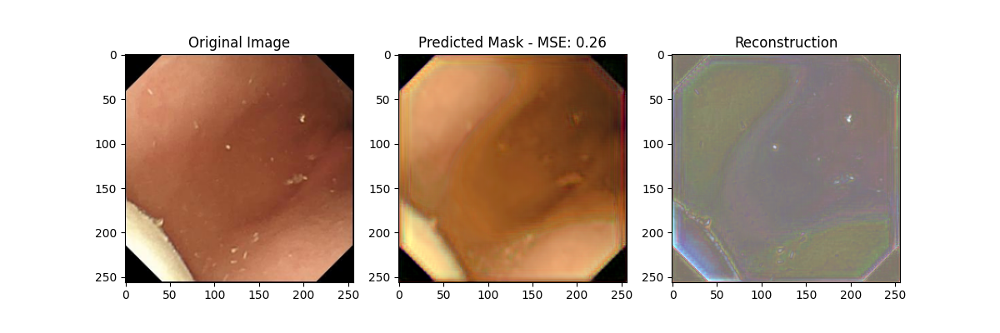

# Darm



## 1. Create Conda Environment

1. Run the following command to create the Conda environment:

    ```bash
    conda env create -f environment.yml
    ```

2. Activate the environment:

    ```bash
    conda activate darm
    ```

## 2. Replace Files

Replace the following files in the environment with the versions in `files_to_replace_in_env`:

- `Lib\site-packages\backbones_unet\utils\dataset.py`
- `Lib\site-packages\backbones_unet\utils\trainer.py`
- `Lib\site-packages\backbones_unet\model\losses.py`
- `Lib\site-packages\backbones_unet\model\unet.py`

## 3. Run the Script

Run `sample.py`:

```bash
python sample.py
